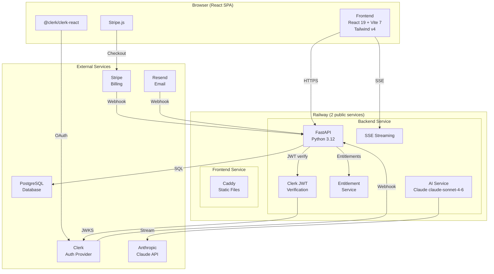
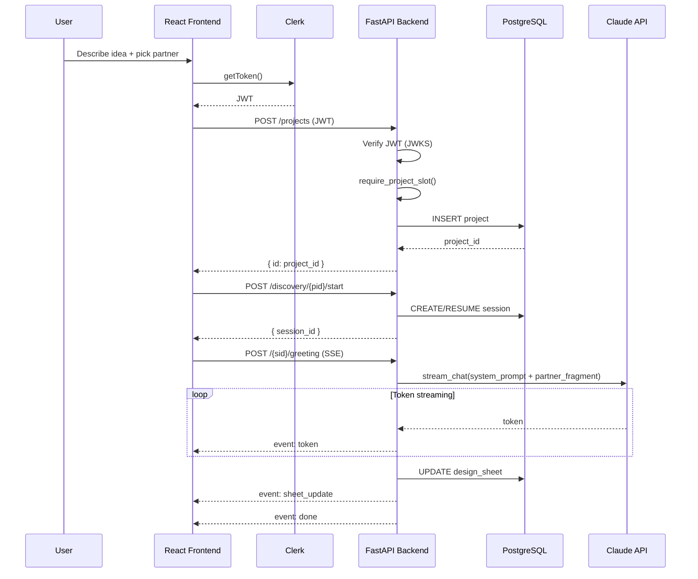
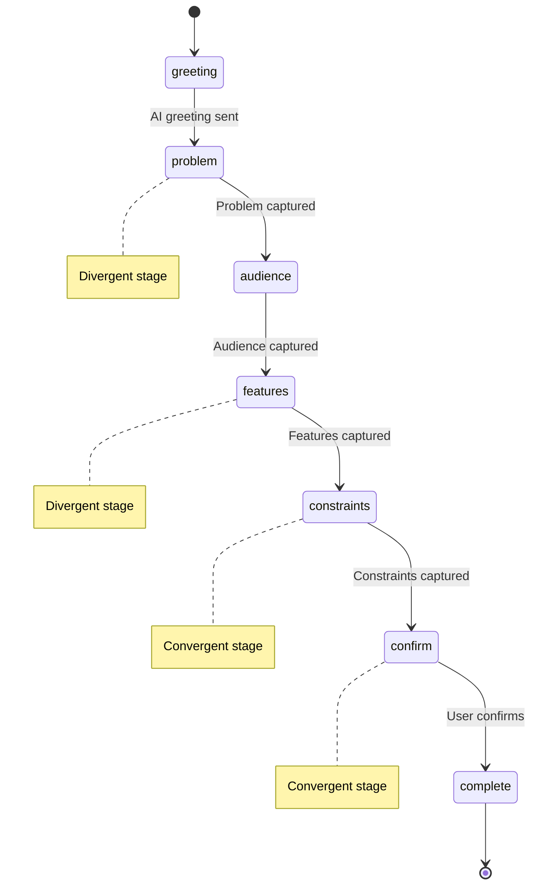
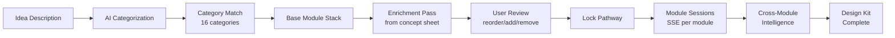
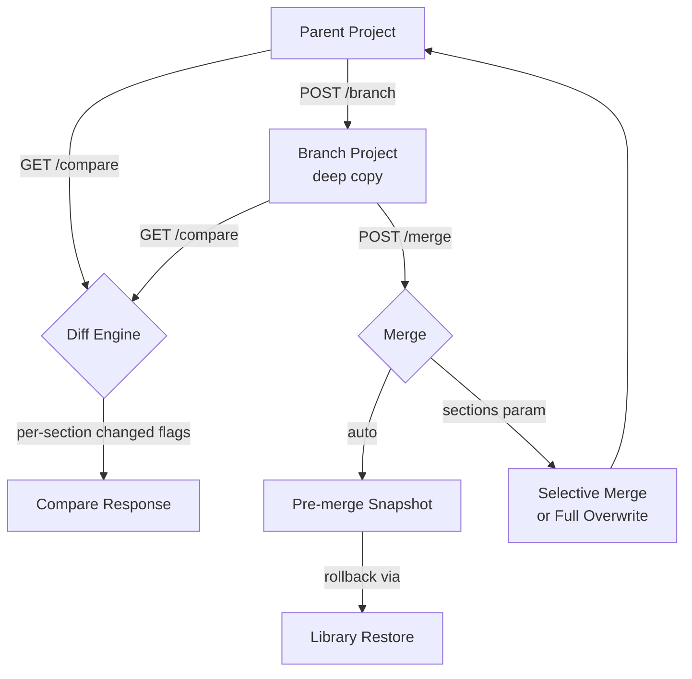
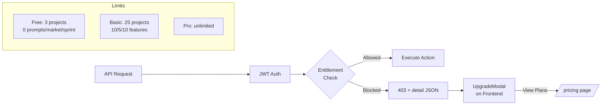

# Ide/AI — Architecture Document

> Last updated: 2026-05-22

## Directory Structure
```
Ide_AI/
├── frontend/                  # React/Vite app
│   ├── src/
│   │   ├── components/        # Reusable UI components
│   │   │   ├── ui/            # Base: Button, Card, Input, Badge, Drawer, Modal
│   │   │   ├── layout/        # Sidebar (desktop + mobile bottom nav)
│   │   │   ├── nebula/        # IdeaNebulaCanvas (canvas animation)
│   │   │   ├── auth/          # ProtectedRoute (Clerk auth gate)
│   │   │   ├── partner/       # PartnerCard, PartnerSelector, ActivePartnerBadge
│   │   │   ├── home/          # PresetCard, TemplateGrid
│   │   │   ├── discovery/     # ChatBubble, TopBar, SheetSidebar, QuickChips
│   │   │   ├── framework/     # DesignSheetPanel, SheetCard, ReadinessScores
│   │   │   ├── blocks/        # BlocksBoard, BlockCard, ScopeSlider
│   │   │   ├── pipeline/      # PipelineCanvas, PipelineCard, CostPanel
│   │   │   ├── promptkit/     # PromptKitPanel, PromptSnippet
│   │   │   ├── projects/      # FolderTree, ProjectCard, VersionTimeline
│   │   │   ├── pitch/         # PitchDocument, SharePanel
│   │   │   ├── sharing/       # ShareDialog, CommentSection, StarRating, FeedbackPanel
│   │   │   ├── voice/         # VoiceMicButton (Web Speech API)
│   │   │   └── tutorial/      # StageInterlude, PulseBeacon, Whisper
│   │   ├── pages/             # Route-level page components
│   │   │   ├── Landing.tsx            # Public landing, pricing
│   │   │   ├── SignInPage.tsx         # Clerk sign-in
│   │   │   ├── SignUpPage.tsx         # Clerk sign-up
│   │   │   ├── CheckoutRedirect.tsx   # Stripe post-checkout
│   │   │   ├── Home.tsx               # Idea input, partner grid, templates
│   │   │   ├── Discovery.tsx          # SSE chat with AI partner
│   │   │   ├── Blocks.tsx             # Feature blocks board
│   │   │   ├── Pipeline.tsx           # Stack recommendation canvas
│   │   │   ├── PromptKit.tsx          # Platform-specific prompt generation
│   │   │   ├── Exports.tsx            # Export generation + snapshots
│   │   │   ├── MarketAnalysis.tsx     # Competitive analysis
│   │   │   ├── SprintPlanner.tsx      # Sprint plan generation
│   │   │   ├── PitchMode.tsx          # Shareable one-page brief
│   │   │   ├── Profile.tsx            # Avatar, bio, billing portal
│   │   │   ├── Inbox.tsx              # Idea inbox
│   │   │   ├── Library.tsx            # Project library with progress metadata
│   │   │   ├── Settings.tsx           # App settings, tutorial reset
│   │   │   ├── SharedProject.tsx      # Public shared view with feedback
│   │   │   ├── PathwayReview.tsx      # Module pathway review/reorder
│   │   │   ├── PathwayExecute.tsx     # Module pathway execution
│   │   │   └── ModuleSession.tsx      # Per-module AI conversation
│   │   ├── stores/            # Zustand: authStore, pathwayStore, modulePathwayStore, tutorialStore
│   │   ├── hooks/             # useSSE, useVoiceInput
│   │   ├── lib/               # apiClient (axios with Clerk auth interceptor)
│   │   ├── types/             # TypeScript interfaces
│   │   └── styles/            # Tailwind v4 CSS globals
│   ├── index.html
│   ├── vite.config.ts
│   └── package.json
│
├── backend/                   # FastAPI app
│   ├── app/
│   │   ├── main.py            # FastAPI app, CORS, router registration
│   │   ├── core/
│   │   │   ├── config.py      # Settings via pydantic-settings
│   │   │   ├── clerk.py       # Clerk JWT verification (JWKS/RS256)
│   │   │   └── database.py    # Async SQLAlchemy engine + session
│   │   ├── models/            # SQLAlchemy ORM models (all UUID PKs)
│   │   │   ├── user.py, project.py, session.py, design_sheet.py
│   │   │   ├── block.py, pipeline_node.py, prompt_kit.py
│   │   │   ├── market_analysis.py, sprint_plan.py, version.py
│   │   │   ├── idea_inbox.py, project_share.py, share_comment.py, share_rating.py
│   │   │   ├── project_template.py, project_snapshot.py
│   │   │   ├── concept_branch.py, external_integration.py
│   │   │   ├── module_pathway.py, module_response.py, module_artifact.py
│   │   │   └── user_memory.py, email_verification.py, password_reset.py
│   │   ├── schemas/           # Pydantic v2 request/response schemas
│   │   ├── routers/           # One file per domain
│   │   │   ├── auth.py                # Clerk-based auth, entitlements
│   │   │   ├── billing.py             # Stripe checkout, portal, webhook
│   │   │   ├── clerk_webhook.py       # Clerk user sync
│   │   │   ├── projects.py            # Project CRUD (entitlement gated)
│   │   │   ├── discovery.py           # SSE chat, idempotent start
│   │   │   ├── blocks.py, pipeline.py, design_sheet.py, exports.py
│   │   │   ├── prompts.py             # Prompt kit (entitlement gated)
│   │   │   ├── market.py              # Market analysis SSE (entitlement gated)
│   │   │   ├── sprints.py             # Sprint plans (ownership checked)
│   │   │   ├── sharing.py             # Sharing with feedback/ratings
│   │   │   ├── library.py             # Library with progress metadata, snapshots
│   │   │   ├── inbox.py, templates.py, meta.py, pathways.py
│   │   │   ├── branching.py           # Deep-copy branching, compare, merge
│   │   │   ├── integrations.py        # External tools (coming_soon)
│   │   │   ├── webhooks.py            # Inbound email (HMAC verified)
│   │   │   └── module_pathway.py, modules.py
│   │   ├── services/          # Business logic
│   │   │   ├── ai_service.py          # Claude API: prompt builder, stream_chat
│   │   │   ├── partner_style_service.py  # 10 AI partner styles + prompt fragments
│   │   │   ├── discovery_service.py   # Session management, stage progression
│   │   │   ├── pathway_service.py     # 4 concept pathway definitions
│   │   │   ├── sheet_service.py       # Design sheet CRUD + block generation
│   │   │   ├── pipeline_service.py    # Stack recommendation, cost estimation
│   │   │   ├── export_service.py      # MD/PDF/DOCX/ZIP generation
│   │   │   ├── prompt_kit_service.py, prompt_package_service.py
│   │   │   ├── market_service.py, market_export_service.py
│   │   │   ├── sprint_service.py, email_service.py
│   │   │   ├── categorization_service.py, modular_pathway_service.py, module_service.py
│   │   │   ├── entitlement_service.py  # Plan limits (free/basic/pro)
│   │   │   └── sharing_service.py, library_service.py, memory_service.py, transcript_service.py
│   │   ├── alembic/versions/  # DB migrations (001–023, linear chain)
│   │   └── templates/         # Jinja2 templates for prompts + exports
│   ├── tests/                 # Unit + integration tests
│   ├── pyproject.toml, Dockerfile, railway.toml
│
├── project_templates.seed.json
├── docker-compose.yml
├── CLAUDE.md, CONTEXT_HANDOFF.md, ARCHITECTURE.md
└── AI_PARTNER_SELECTOR_SPEC.md
```

## Database Schema (Key Tables)
```
users               id, email, clerk_user_id, email_verified, account_type, bio, inbox_email, stripe_customer_id, avatar_url, preferences JSONB
projects            id, user_id, name, description, accent_color, platform, audience, complexity, tone, pathway_id, ai_partner_style, primary_category, secondary_category
sessions            id, project_id, status (active|complete), stage, messages JSONB, ai_partner_style
design_sheets       id, project_id (unique), problem, audience, mvp, features JSONB, tone, platform, tech_constraints, success_metric, fields_data JSONB, confidence_score
blocks              id, project_id, name, description, category, priority (mvp|v2), effort (S|M|L), order, is_mvp
pipeline_nodes      id, project_id, layer, selected_tool, config JSONB
prompt_kits         id, project_id, platform, content TEXT, version INT
market_analyses     id, project_id (unique), user_id, target_market JSONB, competitive_landscape JSONB, market_metrics JSONB, revenue_projections JSONB, marketing_strategies JSONB, status
sprint_plans        id, project_id, user_id, status, milestones JSONB, sprints JSONB, timeline JSONB
project_snapshots   id, project_id, user_id, name, description, snapshot_data JSONB, version INT
project_shares      id, project_id, token, allow_feedback, allow_ratings, expires_at, password_hash
share_comments      id, share_id, author_name, content
share_ratings       id, share_id, block_id, score (1-5)
idea_inbox_items    id, user_id, subject, body, source, sender_email, partner_style, provider_event_id
module_pathways     id, project_id, modules JSONB, lite_deep_settings JSONB, status
module_responses    id, project_id, module_id, responses JSONB, status, completed_at
concept_branches    id, parent_project_id, branch_project_id, branch_name, description, created_by
user_integrations   id, user_id, provider, encrypted_token, status
project_templates   id, category, name, description, prefill JSONB
user_memory         id, user_id, key, value
```

## Auth & Billing Architecture
- **Clerk** handles all sign-in/sign-up (email/password + Google, Microsoft, GitHub OAuth)
- Clerk webhook (`POST /webhooks/clerk`) syncs user records to local DB
- Backend verifies Clerk session JWTs via JWKS/RS256 (`core/clerk.py`)
- Frontend attaches Clerk session token via `apiClient.ts` interceptor
- **Stripe** handles subscription billing (Basic Monthly/Yearly, Pro Monthly/Yearly)
- Stripe webhook syncs `stripe_customer_id` and subscription status
- `entitlement_service.py` enforces plan limits: project count, prompt kits, market analysis

## AI Service Design
- All Claude calls go through `ai_service.py` (model: claude-sonnet-4-6)
- 3-layer prompt composition: (1) Base pathway persona → (2) Partner style fragment → (3) Session context
- 10 AI partner styles change collaboration behavior (not cosmetic) — partner choice never alters structured output schema
- Discovery uses a state machine: stages defined per pathway (divergent/convergent mix)
- Confidence score computed after each turn (0–100) based on design_sheet field completeness
- SSE streaming: FastAPI StreamingResponse with `text/event-stream`, frontend uses EventSource
- Module system: per-module SSE conversations with `[MODULE_COMPLETE]` and `[CHIPS:]` markers

## Modular Pathway System
- 16 concept categories (software, food, film, fashion, etc.)
- 47-module library with Lite (2–3 questions) / Deep (6–10 questions) modes
- Categorization: AI analyzes project name + description + concept sheet
- Assembly: base stack (from category) → enrichment pass (from concept sheet) → user review
- Cross-module intelligence: 7 field mapping rules pre-populate from earlier modules
- Seed data: `concept_categories.seed.json`, `module_library.seed.json`

## Security
- JWT verification with Clerk JWKS (issuer/audience/authorized-party validation via env vars)
- Ownership checks on all project-scoped endpoints (sharing, sprints, branching)
- Share expiry enforcement on comments, ratings, CSV export
- Inbound email webhook HMAC verification via Svix (Resend)
- Private share viewer tokens: JWT (HS256, 6hr) for password-protected share feedback
- External integration tokens encrypted with Fernet
- Centralized entitlement guards (`require_project_slot`, `require_feature_usage`) on all creation paths
- 256KB payload limit on inbound email webhook

---

## System Architecture Diagram



## Request Lifecycle



## Discovery State Machine



## Modular Pathway Flow



## Branching & Merge



## Entitlement Gate Flow



## API Documentation

FastAPI auto-generates interactive API docs:

| Endpoint | Format | URL |
|----------|--------|-----|
| Swagger UI | Interactive | `/api/docs` |
| ReDoc | Reference | `/api/redoc` |
| OpenAPI JSON | Machine-readable | `/api/docs/openapi.json` |

All routes are prefixed with `/api/v1`. The OpenAPI spec is generated from Pydantic models and route decorators automatically.
